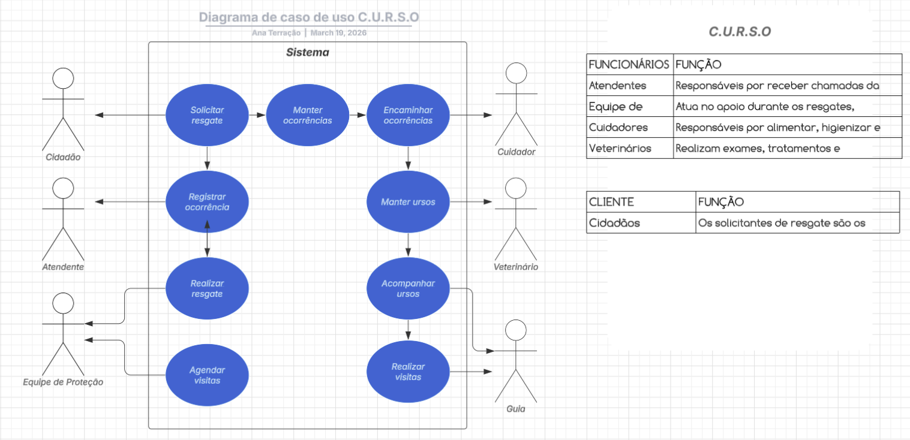

# Fase 2 - Diagrama de Classes (Concluída)

Este arquivo contém o diagrama de classes do projeto C.U.R.S.O. e uma descrição resumida das entidades persistentes.

> Nota: a imagem do diagrama original foi fornecida por ana daniel — créditos da imagem abaixo.

## Diagrama

*Créditos da imagem: ana daniel.*

## Entidades principais (resumo do diagrama de classes)

- `Urso`
	- id: int
	- especie: str
	- idade_aproximada: str
	- sexo: str
	- data_resgate: date
	- estado_saude: str
	- status_atual: str

- `Resgate`
	- id: int
	- localizacao: str
	- data: date
	- descricao: str
	- urso_id: int (FK -> Urso)

- `Santuario`
	- id: int
	- nome: str
	- localizacao: str
	- capacidade: int

- `Cuidador`
	- id: int
	- nome: str
	- telefone: str
	- turno: str
	- santuario_id: int (FK -> Santuario)

## Observações

- As classes acima representam a malha mínima necessária para as operações CRUD da API.
- A modelagem no código deve refletir essas entidades e manter coerência com o script SQL em `sql/schema.sql`.

## Responsabilidade

- Fase 2: concluída (diagrama e resumo adicionados)
- Fase 4: Gabryel-lima

## Créditos

**Author:** Gabryel-lima  
**Co-authors:** Matheus M Guebel, VthugodoNL  
**Créditos (diagrama - imagem):** ana daniel
